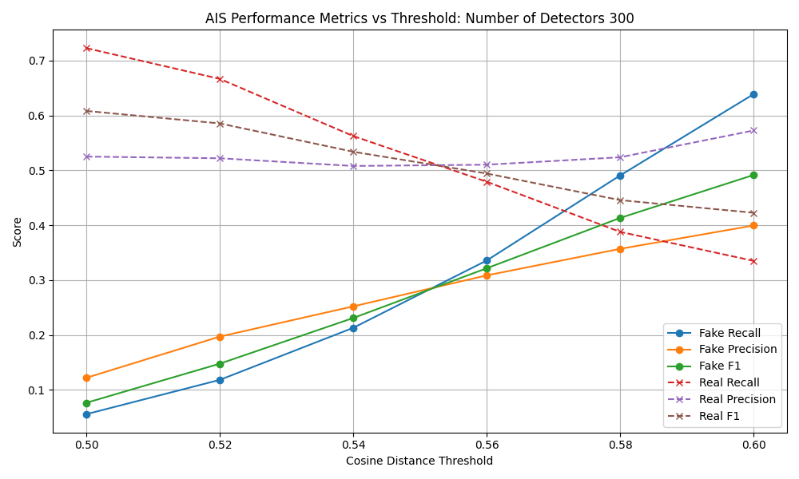
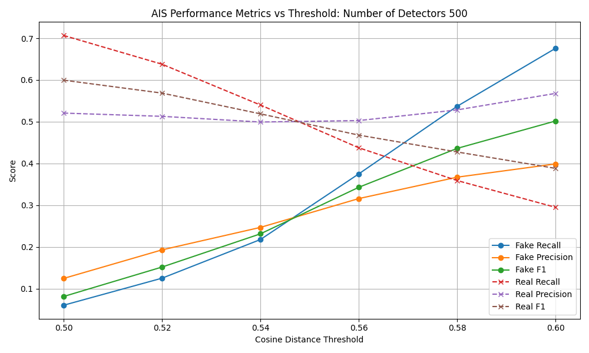

# 🧠 Fake News Detection using Artificial Immune System (AIS)

This project applies the **Negative Selection Algorithm** from Artificial Immune Systems (AIS) to detect fake news articles using semantic embeddings — with **no labeled fake news required for training**.


## 🔍 Problem

Fake news is a major challenge for platforms and public trust. Traditional models rely heavily on labeled datasets. But in real-world scenarios, fake content evolves rapidly — often without labels.


## 💡 Solution

Inspired by the biological immune system, this project uses the **Negative Selection Algorithm** to:

- Generate "detectors" from known **real news** articles
- Flag incoming news as **fake (non-self)** if they activate a detector
- Use **cosine distance** over semantic embeddings to measure anomaly


## 🧬 Why AIS?

Unlike supervised models, this system:
- Requires **no labeled fake data**
- Can generalize to new topics/styles
- Is interpretable and tunable
- Inspired by real-world immune response design


## 📂 Project Structure
```
/notebooks
- ais_detector_pipeline.ipynb
/plots
- threshold_vs_metrics.png
/data
- fakenewsnet.csv
README.md
```


## 🧪 Dataset

- **FakeNewsNet** (real + fake articles)
📚 [References](https://github.com/KaiDMML/FakeNewsNet)

- Shu, K., Mahudeswaran, D., Wang, S., Lee, D., & Liu, H. (2018). **FakeNewsNet: A Data Repository with News Content, Social Context and Dynamic Information for Studying Fake News on Social Media.** *arXiv preprint arXiv:1809.01286*. [arXiv link](https://arxiv.org/abs/1809.01286)

- Shu, K., Sliva, A., Wang, S., Tang, J., & Liu, H. (2017). **Fake News Detection on Social Media: A Data Mining Perspective.** *ACM SIGKDD Explorations Newsletter*, 19(1), 22–36. [DOI](https://doi.org/10.1145/3137597.3137600)

- Shu, K., Wang, S., & Liu, H. (2017). **Exploiting Tri-Relationship for Fake News Detection.** *arXiv preprint arXiv:1712.07709*. [arXiv link](https://arxiv.org/abs/1712.07709)

✅ Includes
- Preprocessed and embedded using **spaCy GloVe** (300-d)
- Only **real articles** used for training detectors


### 📊 Impact of Detector Count on AIS Performance
To understand how number of detectors affect model behaviors, AIS experiments were conduncted using both **300** and **500 detectors**, sweeping cosine distance thresholds from 0.50 to 0.60.


## ⚙️ Approach

- Extract 300–500 detectors by adding controlled noise to real articles
- Use cosine distance to classify test articles as fake/real
- Sweep thresholds (0.5–0.6) to tune tradeoff between precision and recall


## 📊 Results

| Detectors | Fake Recall @ 0.60 | Fake F1 @ 0.58 | Real Recall @ 0.60 |
|-----------|---------------------|----------------|---------------------|
| **300**   | ~0.64               | ~0.50          | ~0.32               |
| **500**   | ~0.68               | **0.52**       | ~0.29               |

These plots below show Fake and Real metrics (Precision, Recall, F1) across thresholds.

- Performance improved significantly over TF-IDF detectors
- Embeddings allowed for semantic anomaly detection
- Tradeoffs visible and tunable via threshold sweep


## 📈 AIS Performance Metrics (300 Detectors)


#### 📈 AIS Performance Metrics (500 Detectors)



### 📌 Takeaway:

- Increasing detector count improves detection sensitivity but slightly increases false positives.
- The model is tunable via threshold to balance real-vs-fake tradeoffs depending on use case.


