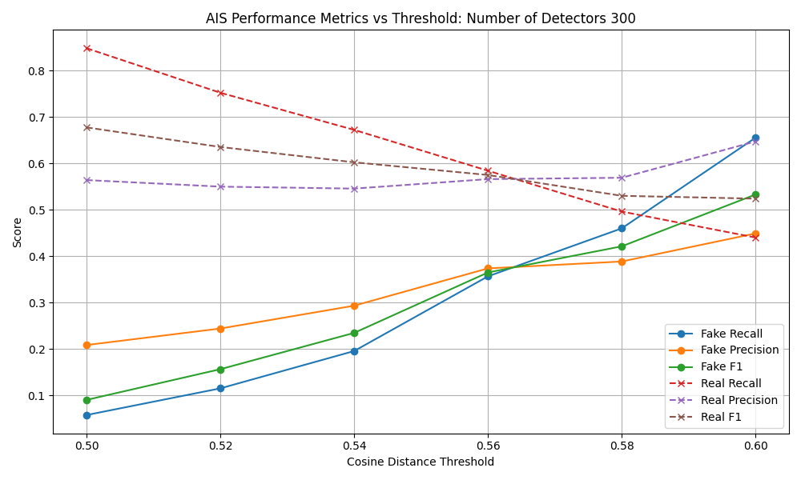
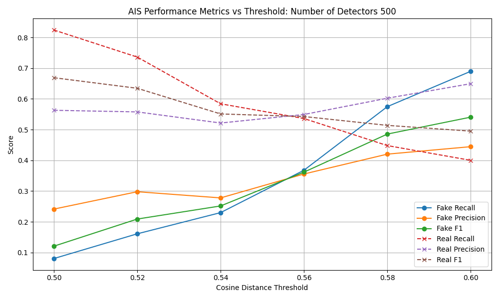

# 🧠 Fake News Detection using Artificial Immune System (AIS)

This project applies the **Negative Selection Algorithm** from Artificial Immune Systems (AIS) to detect fake news articles using semantic embeddings with **no labeled fake news required for training**.

## 🔍 Problem

Fake news is a major challenge for platforms and public trust. Traditional models rely heavily on labeled datasets. But in real-world scenarios, fake content evolves rapidly, often without labels.


## 💡 Solution

Inspired by the biological immune system, this project uses the **Negative Selection Algorithm** to:

- Generate "detectors" from known **real news** articles
- Flag incoming news as **fake (non-self)** if they activate a detector
- Use **cosine distance** over semantic embeddings to measure anomaly


## 🧬 Why AIS?

Unlike supervised models, this system:
- Requires **no labeled fake data**
- Can generalize to new topics/styles
- Is interpretable and tunable
- Inspired by real-world immune response design


## 📂 Project Structure
```
/notebooks
- ais_detector_pipeline.ipynb
/plots
- threshold_vs_metrics.png
/data
- fakenewsnet.csv
README.md
```


## 🧪 Dataset

- **FakeNewsNet** (real + fake articles)
📚 [References](https://github.com/KaiDMML/FakeNewsNet)

- Shu, K., Mahudeswaran, D., Wang, S., Lee, D., & Liu, H. (2018). **FakeNewsNet: A Data Repository with News Content, Social Context and Dynamic Information for Studying Fake News on Social Media.** *arXiv preprint arXiv:1809.01286*. [arXiv link](https://arxiv.org/abs/1809.01286)

- Shu, K., Sliva, A., Wang, S., Tang, J., & Liu, H. (2017). **Fake News Detection on Social Media: A Data Mining Perspective.** *ACM SIGKDD Explorations Newsletter*, 19(1), 22–36. [DOI](https://doi.org/10.1145/3137597.3137600)

- Shu, K., Wang, S., & Liu, H. (2017). **Exploiting Tri-Relationship for Fake News Detection.** *arXiv preprint arXiv:1712.07709*. [arXiv link](https://arxiv.org/abs/1712.07709)

✅ Includes
- Preprocessed and embedded using **spaCy GloVe** (300-d)
- Only **real articles** used for training detectors


### 📊 Impact of Detector Count on AIS Performance
To understand how number of detectors affect model behaviors, AIS experiments were conduncted using both **300** and **500 detectors**, sweeping cosine distance thresholds from 0.50 to 0.60.


## ⚙️ Approach

- Implemented a Negative Selection Algorithm inspired by artificial immune systems
- Generated 300–500 detectors by adding controlled noise to fake news embeddings
- Applied self-tolerance filtering by removing detectors that matched real news samples using cosine distance
- During detection, used cosine similarity to compare test articles against detectors
- Swept thresholds (e.g., 0.4–0.6) to tune the precision–recall tradeoff
- Evaluated performance across:
    - AIS-only
    - Supervised Logistic Regression
    - A Hybrid Ensemble using a weighted combination of AIS and ML scores

- Conducted 5-fold cross-validation to ensure robust and generalizable results


## 📊 Exploratory AIS Evaluation 
- As part of the initial EDA, Artificial Immune System (AIS) was implemented using a Negative Selection Algorithm.
This prototype used:
    - Real news samples as self
    - Randomly generated fake-news-based detectors with self-tolerance
    - Cosine Similarity distance thresholding to classify articles as fake.

The model was tested on the full dataset without train/test splits to understand whether anomaly detection could capture
fake news patterns.

| Detectors | Fake Recall @ 0.60 | Fake F1 @ 0.58 | Real Recall @ 0.60 |
|-----------|---------------------|----------------|---------------------|
| **300**   | ~0.64               | ~0.50          | ~0.32               |
| **500**   | ~0.68               | **0.52**       | ~0.29               |

These plots below show Fake and Real metrics (Precision, Recall, F1) across thresholds.

- Performance improved significantly over TF-IDF detectors
- Embeddings allowed for semantic anomaly detection
- Tradeoffs visible and tunable via threshold sweep


## 📈 AIS Performance Metrics (300 Detectors)


#### 📈 AIS Performance Metrics (500 Detectors)



### 📌 Takeaway:

- Increasing detector count improves detection sensitivity but slightly increases false positives.
- The model is tunable via threshold to balance real-vs-fake tradeoffs depending on use case.
- This informed our decision to integrate AIS into a hybrid framework to improve robustness

### 🔬 Model Comparison - 5-Fold Cross-Validation

To rigorously evaluate the model performance, 5-fold cross-validation was done for the following models:
1) AIS only:  Anomaly detection using cosine similarity distance + self-tolerant detectors
2) Logistic Regression:  Supervised baseline using word embeddings
3) Hybrid (AIS + ML): 70% ML + 30% AIS

| Model      | Fake Precision | Fake Recall | Fake F1 | Accuracy |
| ---------- | -------------- | ----------- | ------- | -------- |
| **AIS**    | 0.00           | 0.00        | 0.00    | 59.1%    |
| **ML**     | 72.1%          | 84.5%       | 77.8%   | 80.2%    |
| **Hybrid** | 76.1%          | 66.4%       | 70.9%   | 77.7%    |


The AIS model struggled to detect fake samples on its own, likely due to overlapping feature distributions
and limited detector coverage.  However, combining AIS with logistic regression model improved precision and
robustness, showing the benefit of incorporating anomaly signals in hybrid classification.


